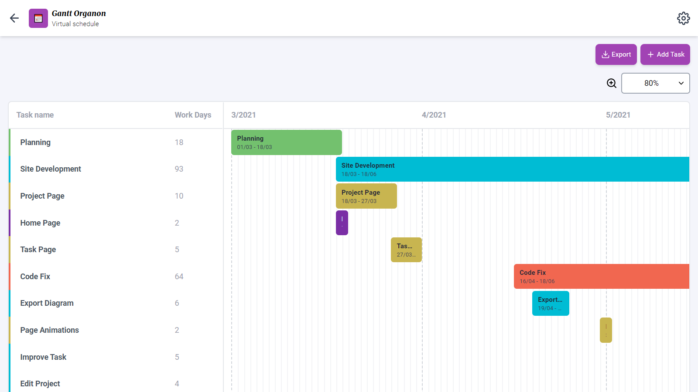
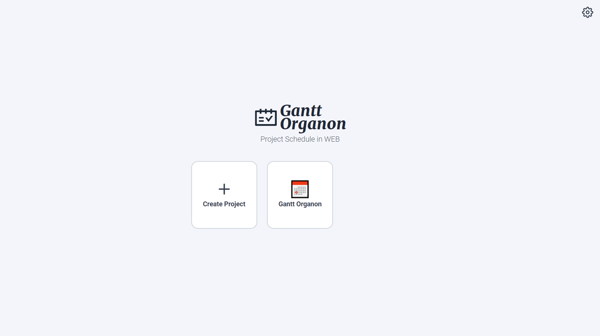
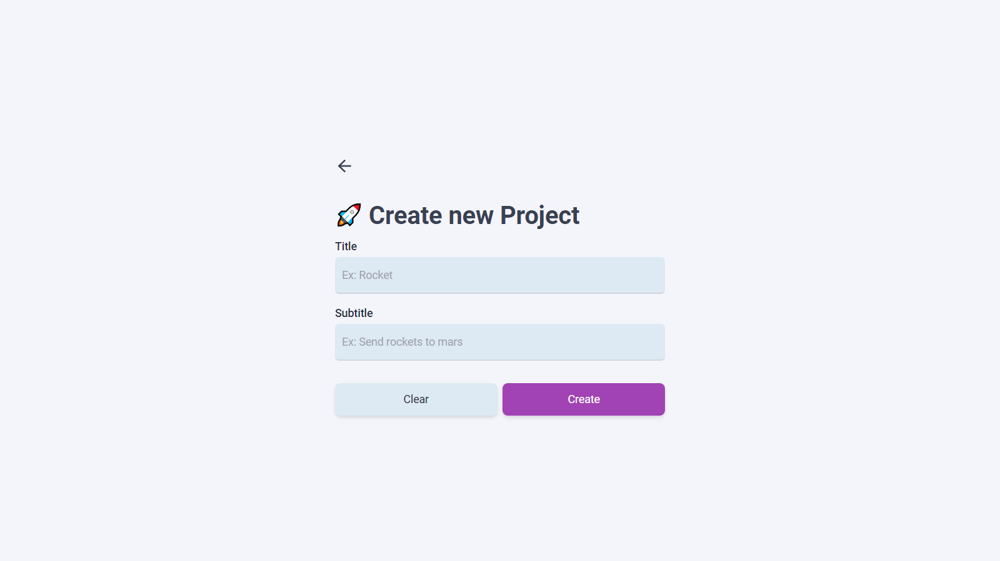
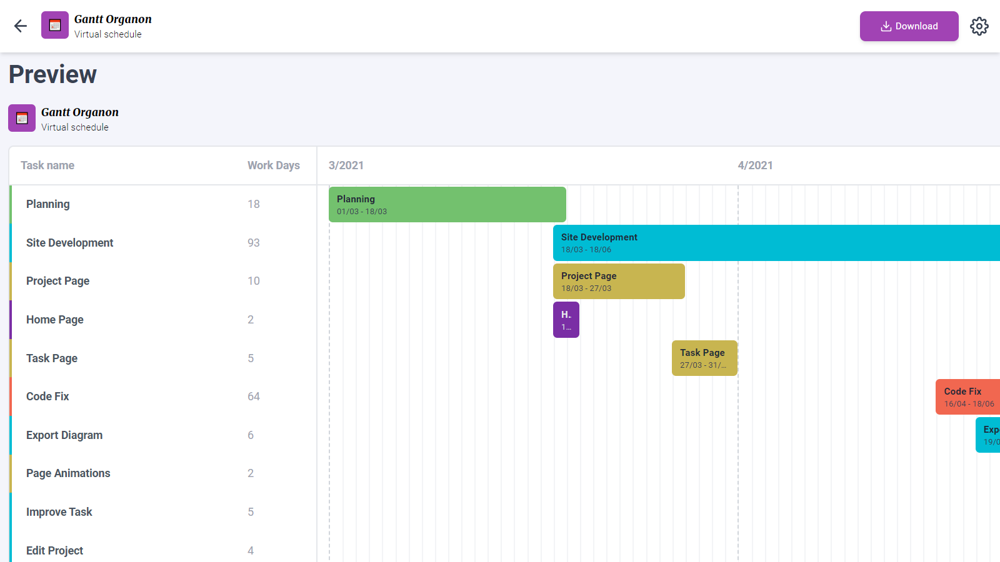

# 📅 Gantt Organon

Gantt Organon is a website that helps you creating a schedule and export it as a image.

<p align="center">
  
  <span>Project Interface</span>
</p>

<p align="center">
  
  
  
  
</p>

## 📂 Boilerplate

This project was bootstrapped with [Create React App](https://github.com/facebook/create-react-app).

You can learn more in the [Create React App documentation](https://facebook.github.io/create-react-app/docs/getting-started).

To learn React, check out the [React documentation](https://reactjs.org/).

## 💻 Technologies

* [Node](https://nodejs.org/en/)
* [React](https://reactjs.org/)
* [Tailwind CSS](https://tailwindcss.com/)
* [WatermelonDB](https://nozbe.github.io/WatermelonDB/)
* [ESLint](https://eslint.org/)

## 📸 Screenshots

<p align="center">
  
  <span>Home Page</span>
</p>

<p align="center">
  
  <span>Create New Project</span>
</p>

<p align="center">
  
  <span>Project Page</span>
</p>

<p align="center">
  
  <span>Export Page</span>
</p>

## 🏃 Getting Started

First, clone this repository and access the created folder:

```bash
# Cloning repository
git clone https://github.com/iamtheluiz/gantt-organon.git

cd gantt-organon/
```

Inside the folder, install all project dependencies:

```bash
npm install
# or
yarn install
```

## 👨🏽‍💻 Usage

To run this project in a local environment use:

```bash
npm run start
# or
yarn start
```

Then open [http://localhost:3000](http://localhost:3000) to view it in the browser.

## ⚙️ Build

To build this project, run:

```bash
yarn build
```

Await the script and you will have a folder "/build" in your project root with all generated static files.

## 💼 Authors

* **Luiz Gustavo** - *Development* - [iamtheluiz](https://github.com/iamtheluiz)
  * Website: https://iamtheluiz.github.io
  * Github: [@iamtheluiz](https://github.com/iamtheluiz)
  * LinkedIn: [Luiz Gustavo da Silva Vasconcellos](https://www.linkedin.com/in/luiz-gustavo-da-silva-vasconcellos-05192a192?lipi=urn%3Ali%3Apage%3Ad_flagship3_profile_view_base_contact_details%3BbQkVQ3sTTv6XCn%2FiToGGcA%3D%3D)

## 📃 License

This project is under the MIT License - see the [LICENSE](LICENSE) file for details.
